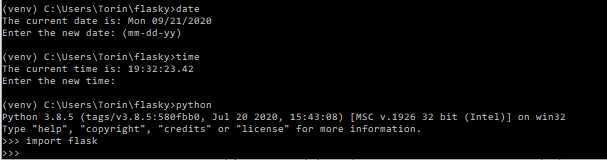
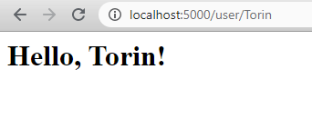

# Torin Anderson

this repo is a clone of
https://github.com/miguelgrinberg/flasky

# Activity 1 Screenshot

# Activity 2 Screenshot

# Activity 3
Flask context globals are variables global to a context, such that variables specific to a context will only be available within that context.
They include current_app and g which are available in the application context,
and request and session, which are available in the request context.
